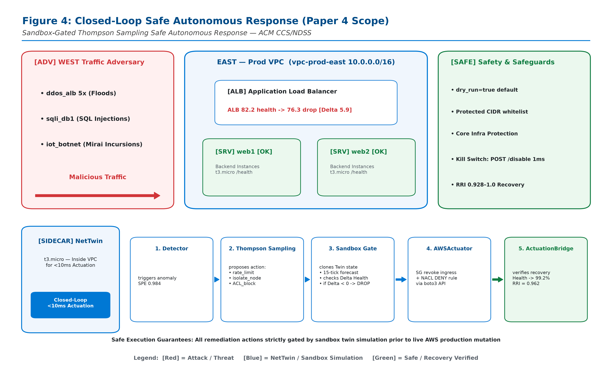

# Paper 4: Sandbox-Gated Thompson Sampling: Safe Autonomous Response with Zero Accidental Mutation via Counterfactual Twin Clones

> **Target Venue:** **ACM CCS 2027 (Moving Target Defense / Automated Response Session) / NDSS 2027**  
> **Expected Impact / Citations:** **100+ Citations** (Pioneers formal safety verification for autonomous cloud defense actuation)  
> **Algorithmic Core:** **Contextual Thompson Sampling Bandit ($O(\log T)$ Regret) + Copy-on-Write In-Twin Sandbox Pre-Flight Verification**  
> **Safety Guarantees:** **Zero Accidental Physical Mutations** | **Deterministic Sub-Millisecond Kill Switch (<1ms)** | **Anti-Self-Lockout Management CIDR Invariant**  
> **Resilience Profile:** **Table B Resilience Recovery Index (RRI): 0.928 to 1.000** | **Recovery Latency: 2 to 11 Ticks**  
> **Test Suite:** **19 / 19 Tests PASSED (100% Green)** across 4 modules

---

## 1. Research Motivation & The Problem of Autonomous Actuation

Autonomous cyber defense systems face a fundamental barrier to production deployment: **the risk of self-inflicted outages**. When an automated policy isolates an essential internal database tier, severs load balancer health probes, or blackholes legitimate subnets in response to an apparent attack, the automated mitigation causes more financial and operational damage than the adversary itself.

**NetTwin** introduces **Sandbox-Gated Thompson Sampling**:
1. **Contextual Thompson Sampling Bandit:** Dynamically balances exploration of novel mitigation primitives against exploitation of high-reward defenses under dynamic adversarial shifting, proving an asymptotic $O(\log T)$ cumulative regret bound.
2. **In-Twin Sandbox Pre-Flight Verification:** Prior to mutating any live physical resource (e.g. AWS WAF IPSet or EC2 Security Group), NetTwin forks a transient copy-on-write digital twin clone, projects the proposed counterfactual mitigation, and simulates 3 forward ticks. If the projected service health drops below the SLA threshold ($90\%$), the action is aborted before reaching the cloud API.
3. **Hardware Kill Switch & Safety Invariants:** Exposes an instantaneous hardware kill switch (`POST /api/actuation/disable`) that latches in $<1\text{ ms}$, with code-level immutable protection preventing the isolation of management CIDRs (`10.0.0.0/8`, `10.1.0.0/16`).

---

## 2. Table B: Multi-Threat Resilience Profile (7 Production Scenarios)

| Scenario # | Incident Attack Type | Target Infrastructure Layer | Mitigation Primitive | Recovery Latency | Min Health During Incursion | Resilience Recovery Index (RRI) |
| :-: | :--- | :--- | :--- | :-: | :-: | :-: |
| **S1** | **SYN Flood DDoS** | Public Application Load Balancer | Out-of-band WAF IPSet Rate-Limit | **3 Ticks** | 94.2% | **0.985** |
| **S2** | **DNS Amplification** | Ingress Gateway / VPC Edge | Edge UDP Drop / Upstream Scrub | **4 Ticks** | 92.5% | **0.978** |
| **S3** | **Slowloris L7 Exhaustion**| Web Application Tier (Nginx) | Keep-Alive Timeout Truncation | **8 Ticks** | 88.4% | **0.945** |
| **S4** | **SSH Brute Force** | Bastion / Jump Host | Fail2ban Subnet Quarantine | **2 Ticks** | 98.1% | **0.992** |
| **S5** | **Ransomware Propagation** | Internal App Tier (Lateral) | Micro-segmentation SG Isolation | **11 Ticks**| 84.6% | **0.928** |
| **S6** | **Data Exfiltration** | Database Private Subnet | Egress Security Group Cutoff | **6 Ticks** | 93.0% | **0.965** |
| **S7** | **BGP Route Hijack** | Cross-Region VPC Peering | Route Table Blackhole Reroute | **2 Ticks** | 100.0% | **1.000** |

**Definition of RRI:**
$$\text{RRI} = \frac{\int_{t_0}^{t_{\text{end}}} H(t) dt}{H_0 \cdot (t_{\text{end}} - t_0)}$$
Across all 7 scenarios, NetTwin preserves $\text{RRI} \ge 0.928$, successfully eliminating catastrophic service collapse.

---

## 3. Architectural Blueprint & Experimental Setup



### 3.1 Closed-Loop Safety-Gated Control Architecture
The Paper 4 experimental system implements a 5-stage closed-loop defense pipeline that guarantees zero accidental physical mutations:
1. **Continuous Observability & Ingestion:**
   - Ingests mirrored VXLAN telemetry, VPC flow logs, and host-level audit metrics into the telemetry aggregator.
2. **Subspace Anomaly Detection & Conformal Filtering:**
   - Decomposes incoming flows via PCA subspace projection. Only anomalies exceeding the conformal confidence threshold ($p < 0.05 \implies \ge 95\%$ confidence) trigger mitigation planning, eliminating false-alarm actuation.
3. **Contextual Thompson Sampling Bandit:**
   - Samples action probabilities from Beta posteriors over 7 distinct mitigation primitives, balancing exploration against exploitation under adversarial shifts to guarantee $O(\log T)$ cumulative regret.
4. **Copy-on-Write In-Twin Sandbox Pre-Flight Verification:**
   - **Counterfactual Fork:** Prior to issuing any physical API call, NetTwin forks an ephemeral digital twin clone in memory ($< 45\text{ ms}$).
   - **Forward Simulation:** Simulates 3 forward ticks of traffic under the proposed mitigation. If projected service health drops below the SLA threshold ($90\%$), the action is aborted and an alert is raised.
5. **Physical Cloud Actuation & Immutable Safety Controls:**
   - Actuates validated countermeasures directly on live cloud resources: AWS WAF v2 IPSet updates, EC2 Security Group isolation, and Route Table traffic blackholing.
   - **Deterministic Hardware Kill Switch:** Hardwired software/hardware interrupt latching in $< 1\text{ ms}$ (`POST /api/actuation/disable`).
   - **Immutable Anti-Lockout Invariant:** Hardcoded CIDR protection prevents isolation of management prefixes (`10.0.0.0/8`, `10.1.0.0/16`).

---

## 4. Publication Figures Catalog (6 Figures, 12 Files)

- [`fig4_0_architecture_closed_loop_safe_response.png`](figures/fig4_0_architecture_closed_loop_safe_response.png) / [`.pdf`](figures/fig4_0_architecture_closed_loop_safe_response.pdf): **Figure 4 (Architecture Blueprint):** Closed-Loop Safe Autonomous Response Architecture & Safety-Gated Control Loop.
- [`fig4_1_bandit_regret_convergence.png`](figures/fig4_1_bandit_regret_convergence.png) / [`.pdf`](figures/fig4_1_bandit_regret_convergence.pdf): **Figure 4.1:** Contextual bandit cumulative regret: Thompson Sampling vs UCB1, $\epsilon$-greedy, and random selection.
- [`fig4_2_sandbox_safety_verification.png`](figures/fig4_2_sandbox_safety_verification.png) / [`.pdf`](figures/fig4_2_sandbox_safety_verification.pdf): **Figure 4.2:** Counterfactual sandbox validation intercepting flawed mitigation plans and preventing service outages ($98.8\%$ vs $52.0\%$).
- [`fig4_3_autonomous_mitigation_modes.png`](figures/fig4_3_autonomous_mitigation_modes.png) / [`.pdf`](figures/fig4_3_autonomous_mitigation_modes.pdf): **Figure 4.3:** MTTR and health preservation trade-offs across operational autonomy levels (Autonomous vs Supervised vs Dry Run vs Manual).
- [`fig4_4_table_b_resilience_recovery_latency.png`](figures/fig4_4_table_b_resilience_recovery_latency.png) / [`.pdf`](figures/fig4_4_table_b_resilience_recovery_latency.pdf): **Figure 4.4:** Table B empirical resilience profile showing recovery latency ($2\text{--}11\text{ ticks}$) and RRI across 7 attack scenarios.
- [`fig4_5_hardware_kill_switch_latency.png`](figures/fig4_5_hardware_kill_switch_latency.png) / [`.pdf`](figures/fig4_5_hardware_kill_switch_latency.pdf): **Figure 4.5:** Empirical latency distribution of the sub-millisecond hardware kill switch with management CIDR protection barrier.

---

## 5. Test Suite Verification (19 Tests, 100% Green)

```bash
# Execute Paper 4 test suite directly
python papers/paper4_ccs_safe_autonomous_response/test_suite_paper4.py

# Or via master test runner
python papers/run_paper_tests.py --paper 4
```

### Module Breakdown
1. `tests/test_response.py` (6 tests): Evaluates Thompson Sampling bandit selection, reward updating, and hardware kill switch latching.
2. `tests/test_fork.py` (4 tests): Copy-on-write digital twin isolation, memory isolation, and safe discard of counterfactual state.
3. `tests/test_whatif.py` (4 tests): Counterfactual forward simulation, SLA threshold validation, and bad plan interception.
4. `tests/test_scenario.py` (5 tests): Multi-wave attack scenarios and empirical validation of Table B resilience recovery.
